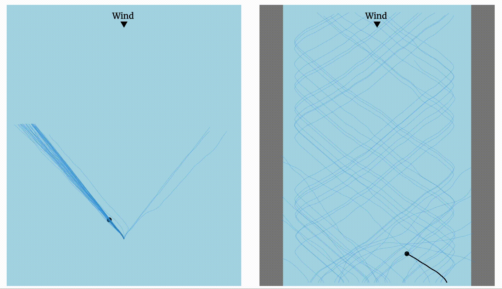

# AI Learns to Sail
Code for the blog post ["AI learns to sail upwind" on the ML&Neuro Blog](https://ppierzc.github.io/ai-learns-to-sail-upwind).

A Q-learning implementation using average reward of the sailing upwind task.
Tackles two tasks: open sea and sailing in the channel.
The open sea just requires to select the appropriate angle to sail along.
The channel task requires the agent to learn how to tack.

## Demo
A live demo is available at [DEMO](https://ppierzc.github.io/ai-learns-to-sail-upwind/#open_sea_container).

## Install
Clone the project.

    git clone https://github.com/PPierzc/ai-learns-to-sail.git
    
open the cloned repository in a terminal

## Tasks
There are currently 2 tasks: sailing in the open sea and in a channel.
In both tasks the goal is to reach as far upwind as possible.

#### Open Sea
The first task is sailing on the open sea.
Here you can go wherever you want since there are no obstacles.
Below is a visualization of the task.
Blue lines show random trajectories, while the black shows a converged trajectory.

###### Run open sea task
To run the task execute:

    python3 ./tasks/open_sea.py

You should get something like the result below.

    Running: Random agent on open sea task: 100%|██████████| 100/100 [00:00<00:00, 275.73it/s]
    Running: Train agent on open sea task: 100%|██████████| 500/500 [00:07<00:00, 67.93it/s]
    Results from last 100 episodes
    | ===== agent ===== | ===== mean ===== | ===== std ===== |
    | Random            | 52.52            | 35.16           |
    | Trained           | 107.89           | 10.36           |
    
###### Run the DQN solution of the open sea task 
To run the DQN solution of the task execute:

    python3 ./tasks/open_sea.py
    
You should get something like the result below.
    
    Running: Random agent on open sea task: 100%|██████████| 100/100 [00:00<00:00, 602.97it/s]
    Running: Generating training data for the open sea task: 100%|██████████| 50000/50000 [00:01<00:00, 43604.19it/s]
    Running: Training DQN on open sea task: 100%|██████████| 301/301 [11:03<00:00,  2.20s/it]
    Running: Evaluate DQN on open sea task: 100%|██████████| 50/50 [05:33<00:00,  6.67s/it
    Results from last 50 episodes
    | ===== agent ===== | ===== mean ===== | ===== std ===== |
    | Random            | 52.52            | 35.16           |
    | DQN               | 99.42            | 9.08            |
    
#### Channel
The second task involves sailing in a tight channel.
Following a straight line is no longer the optimal solution as it would lead to a crash with a side pier.
Instead the agent has to learn how to tack to avoid getting destroyed.

Below you will find a visualisation of the task along with a random solution (blue) and an optimal solution (black).

###### Run channel task
To run the task execute:

    python3 ./tasks/channel.py

You should get something like the result below.

    Running: Random agent on channel sea task: 100%|██████████| 100/100 [00:00<00:00, 602.28it/s]
    Running: Train agent on channel sea task: 100%|██████████| 1000/1000 [00:11<00:00, 86.73it/s]
    Results from last 100 episodes
    | ===== agent ===== | ===== mean ===== | ===== std ===== |
    | Random            | 19.86            | 11.88           |
    | Trained           | 63.94            | 19.47           |
    
## License
Distributed under the [MIT License](/LICENSE)

## Contribution and Ideas
If you have any cool ideas that you think this agent should try then share them as an issue or create a pull request.