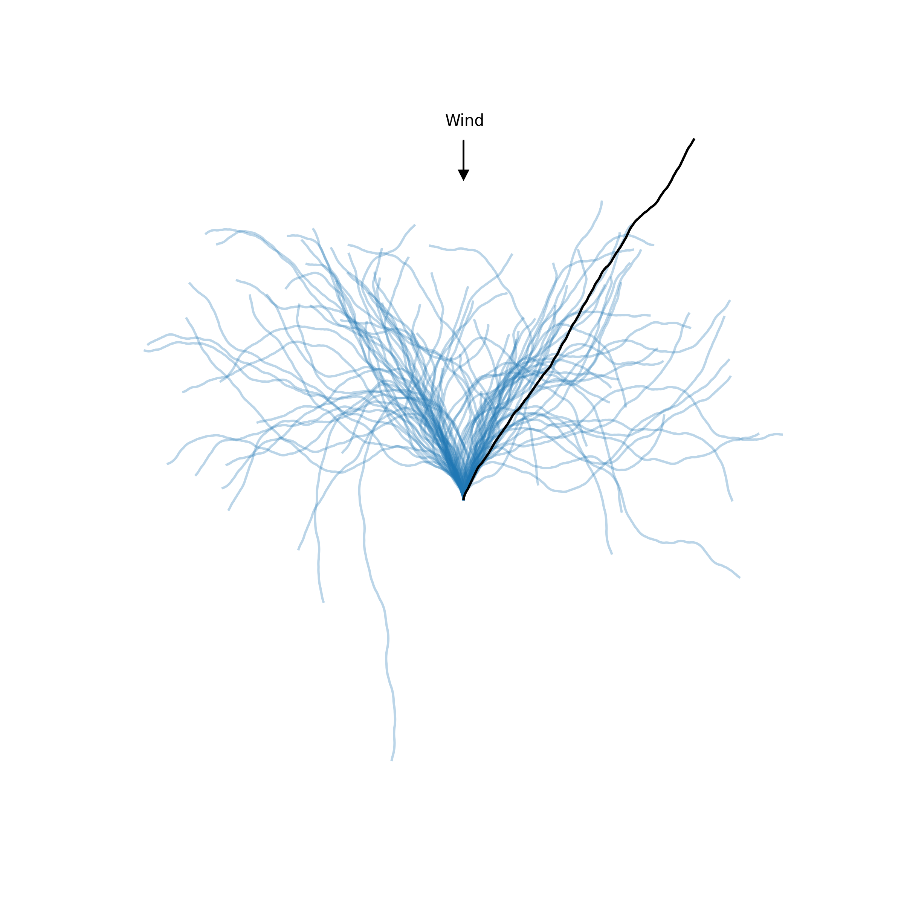
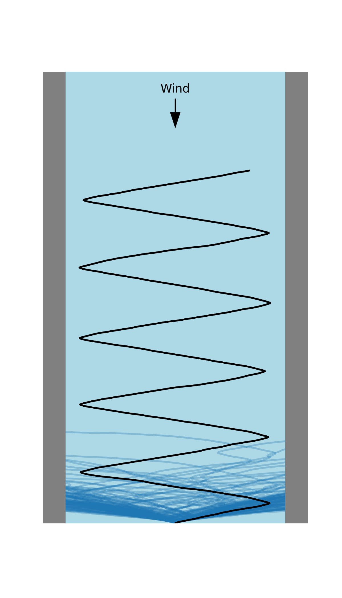

# AI Learns to Sail

## Open Sea

    Running: Random agent on open sea task: 100%|██████████| 100/100 [00:00<00:00, 275.73it/s]
    Running: Train agent on open sea task: 100%|██████████| 500/500 [00:07<00:00, 67.93it/s]
    Results from last 100 episodes
    | ===== agent ===== | ===== mean ===== | ===== std ===== |
    | Random            | 52.52            | 35.16           |
    | Trained           | 107.89           | 10.36           |
    
## Channel

    Running: Random agent on channel sea task: 100%|██████████| 100/100 [00:00<00:00, 602.28it/s]
    Running: Train agent on channel sea task: 100%|██████████| 1000/1000 [00:11<00:00, 86.73it/s]
    Results from last 100 episodes
    | ===== agent ===== | ===== mean ===== | ===== std ===== |
    | Random            | 19.86            | 11.88           |
    | Trained           | 63.94            | 19.47           |